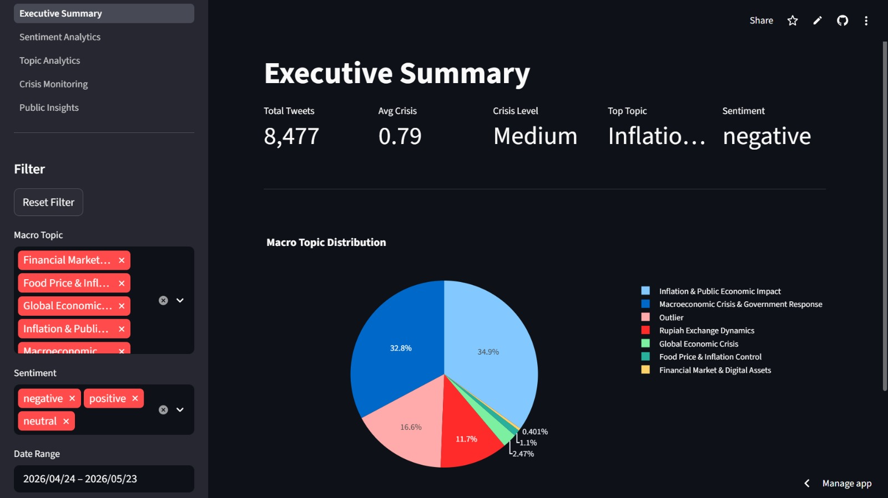
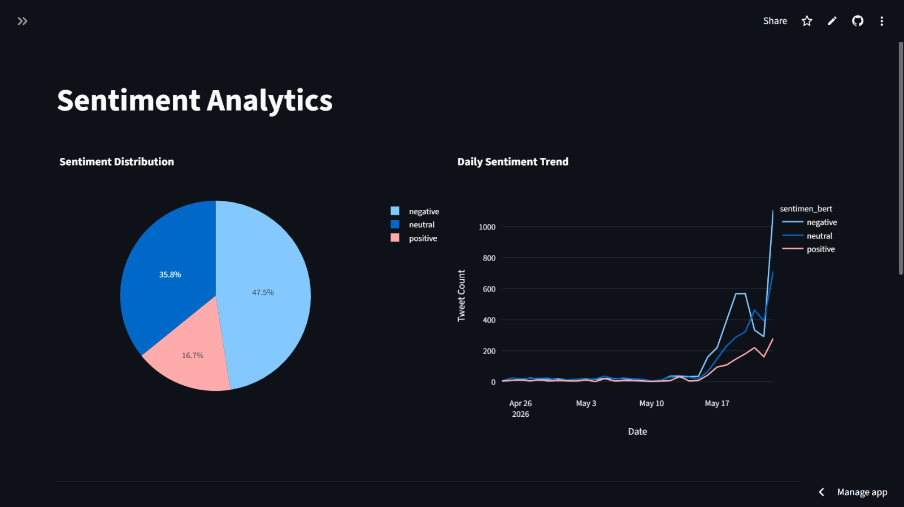
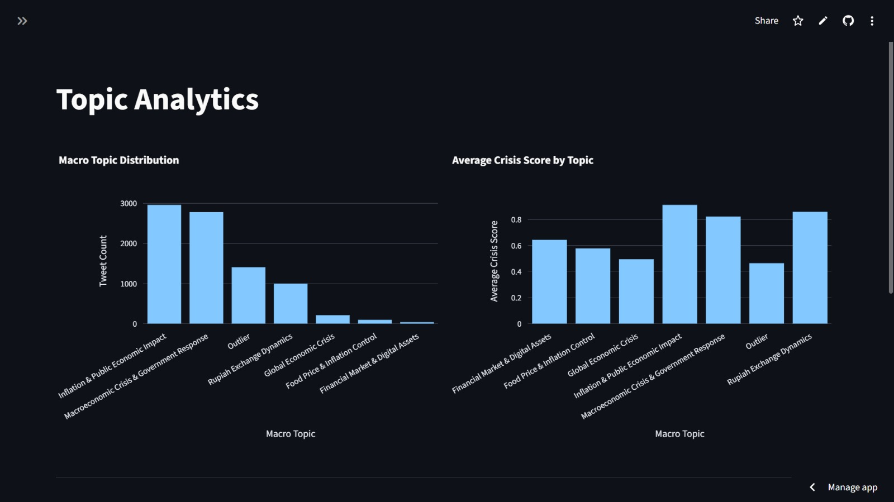

# Real-Time Social Media Monitoring of Rupiah Exchange Rate Issues Using Transformer-Based NLP

[](https://www.python.org/)
[](https://monitoring-of-rupiah-exchange-issues.streamlit.app/)
[](https://huggingface.co/)
[](https://maartengr.github.io/BERTopic/)

## Live Dashboard

https://monitoring-of-rupiah-exchange-issues.streamlit.app/

---

## Project Overview

Public discussions around exchange rates often reflect broader economic concerns. Changes in rupiah value, inflation, purchasing power, and public confidence can quickly become highly discussed topics across social media platforms.

This project builds an end-to-end monitoring system to analyze conversations related to rupiah exchange rate issues on X (Twitter). The system collects public discussions, processes textual data, identifies sentiment patterns, extracts major discussion themes, and estimates crisis indicators based on weighted topic analysis.

The goal is to provide a structured approach for understanding how economic issues are perceived and discussed by the public in real time.

---

## Dashboard Preview

### Executive Summary



### Sentiment Analytics



### Topic Analytics



---

## Main Objectives

* Monitor public conversations related to rupiah exchange rate issues
* Analyze sentiment trends from social media discussions
* Identify dominant discussion themes through topic modeling
* Detect potential crisis signals using a weighted scoring approach
* Provide an interactive dashboard for monitoring and exploration

---

## System Workflow

The system processes social media data through several stages before generating crisis indicators and interactive visualizations.

```text
                            Raw Tweets
                  (id, text, created_at)
                                   │
                                   ↓
                      Remove Duplicate Data
                                   │
                                   ↓
                         Remove Missing Values
                                   │
                                   ↓
                              Text Cleaning
                                   │
                                   ↓
                            Text Normalization
                                   │
                 ┌─────────────────┴─────────────────┐
                 │                                   │
                 │                                   │
                 ↓                                   ↓
      Sentiment Analysis                     Topic Modeling
          (RoBERTa)                            (BERTopic)
                 │                                   │
                 ↓                                   ↓
         id, sentiment                         id, topic
                 │                                   │
                 └─────────────────┬─────────────────┘
                                   │
                                   ↓
                                Merge
                                   │
                                   ↓
                         Crisis Detection
                                   │
                                   ↓
                        Interactive Dashboard
```

---

## Data Collection

Data were collected from X (Twitter) using Apify API.

To use the scraping module:

1. Create an account at:

https://console.apify.com/

2. Generate your API token.

3. Use the following actor:

```text
kaitoeasyapi/premium-x-follower-scraper-following-data
```

4. Store the token inside a local `.env` file:

```env
APIFY_TOKEN=your_api_token
```

The scraping module retrieves public posts related to:

* Rupiah
* Dollar exchange rate
* Inflation
* Economic crisis
* Indonesian economy

---

## Technologies Used

| Category             | Technology            |
| -------------------- | --------------------- |
| Programming Language | Python                |
| Dashboard            | Streamlit             |
| Data Collection      | Apify API             |
| Sentiment Analysis   | Indonesian RoBERTa    |
| Topic Modeling       | BERTopic              |
| Embedding            | Sentence Transformers |
| Visualization        | Plotly, Matplotlib    |
| Data Processing      | Pandas, NumPy         |

---

## Project Structure

```text
REAL-TIME-SOCIAL-MEDIA-MONITORING/

├── app/
│   ├── assets/
│   ├── pages/
│   ├── app.py
│   └── utils.py
│
├── data/
│   ├── raw/
│   └── processed/
│
├── notebooks/
│
├── src/
│   ├── scraping/
│   ├── preprocessing/
│   ├── modeling/
│   └── pipeline.py
│
├── requirements.txt
├── .gitignore
├── .env.example
└── README.md
```

---

## Dashboard Features

### Executive Summary

* Total collected tweets
* Average crisis score
* Dominant discussion topic
* Overall sentiment overview

### Sentiment Analytics

* Sentiment distribution
* Daily sentiment trends
* Sentiment by topic

### Topic Analytics

* Macro topic distribution
* Topic crisis score comparison

### Crisis Monitoring

* Daily crisis trend monitoring
* Crisis level identification
* Main crisis triggers

### Public Insights

* Top discussion topics
* Public engagement patterns
* Representative public opinions

---

## Installation

Clone the repository:

```bash
git clone https://github.com/Nadeeu/Real-Time-Social-Media-Monitoring-of-Rupiah-Exchange-Rate-Issues-Using-Transformer-Based-NLP.git
```

Move into the project directory:

```bash
cd Real-Time-Social-Media-Monitoring-of-Rupiah-Exchange-Rate-Issues-Using-Transformer-Based-NLP
```

Install required libraries:

```bash
pip install -r requirements.txt
```

Run the processing pipeline:

```bash
python src/pipeline.py
```

Run the dashboard:

```bash
streamlit run app/app.py
```

---

## Future Improvements

Several improvements can be explored in future development:

* Scheduled automatic data collection
* Real-time pipeline execution
* Alert notification system
* Additional economic indicators
* Improved topic labeling
* Model optimization for faster inference

---

## Developed By

**Nada Firdaus**

GitHub:

https://github.com/Nadeeu